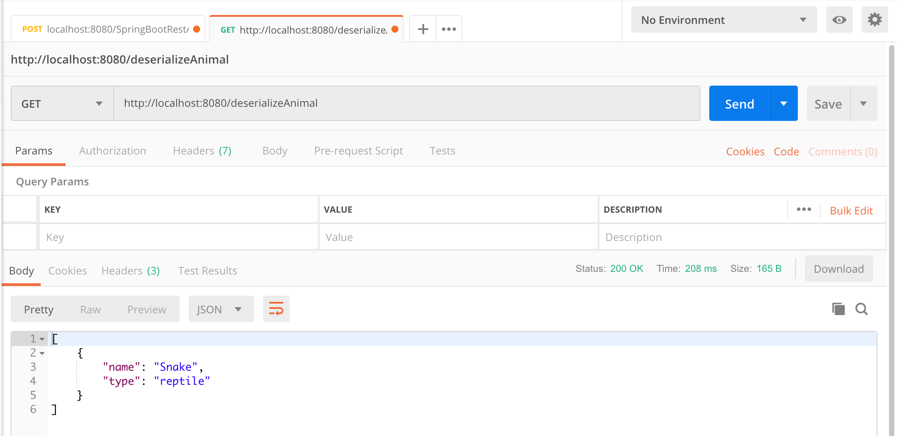

# springboot-serde

* The project is constructed and run with **Spring boot**. There is a rest api which has two methods one of which is a **post** for **serializing** the model object and the other one is a **get** for **deserializing** and listing all objects which are serialized before.

* As it can be observed in the code, there are packages for **service, controller and repository** layers.

* The serialized model class can be found in model package. A simple **animal** class is used for this .

* Embedded in memory **H2** db is used which is coming out of the box with springboot.

* The serialization and deserialization is achieved via private methods in service impl class.
    ```
      private byte[] serialize(Animal animal) throws IOException {
      ByteArrayOutputStream byteArrayOutputStream = new ByteArrayOutputStream();
      ObjectOutputStream objectOutputStream = new ObjectOutputStream(byteArrayOutputStream);
      try {
    
        objectOutputStream.writeObject(animal);
    
        return byteArrayOutputStream.toByteArray();
      } catch (IOException e) {
        // TODO Auto-generated catch block
        e.printStackTrace();
      } finally {
        objectOutputStream.close();
      }
    
      return null;
    
    }
    
      private Animal deserialize(byte[] serializedAnimal) throws IOException, ClassNotFoundException {
      ByteArrayInputStream byteArrayInputStream = new ByteArrayInputStream(serializedAnimal);
      ObjectInputStream objectInputStream = new ObjectInputStream(byteArrayInputStream);
      try {
    
        Animal animal = (Animal) objectInputStream.readObject();
    
        return animal;
      } catch (IOException e) {
        // TODO Auto-generated catch block
        e.printStackTrace();
      } finally {
        objectInputStream.close();
      }
    
      return null;
    
    }
    ```
## Screen shot

* **Post new data**


* **Get all data**

